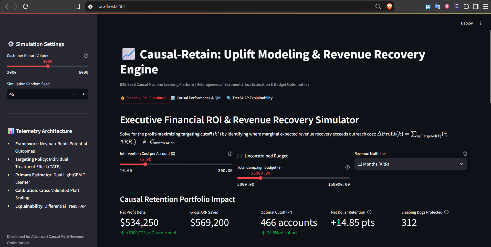
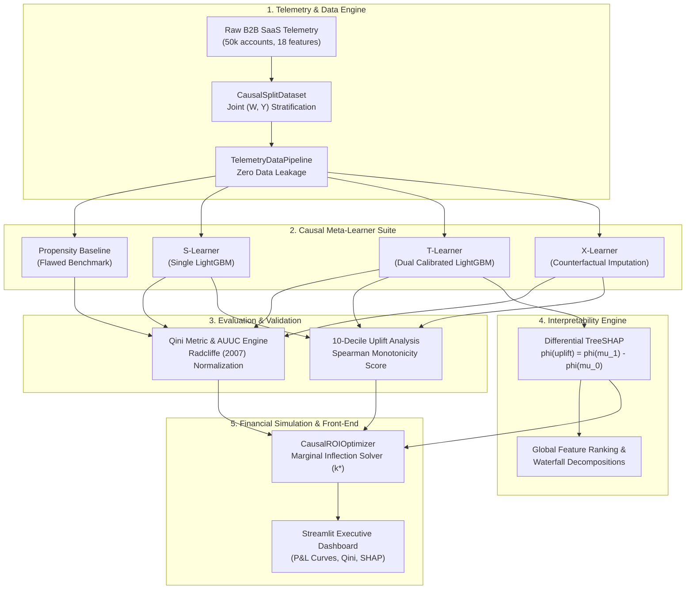
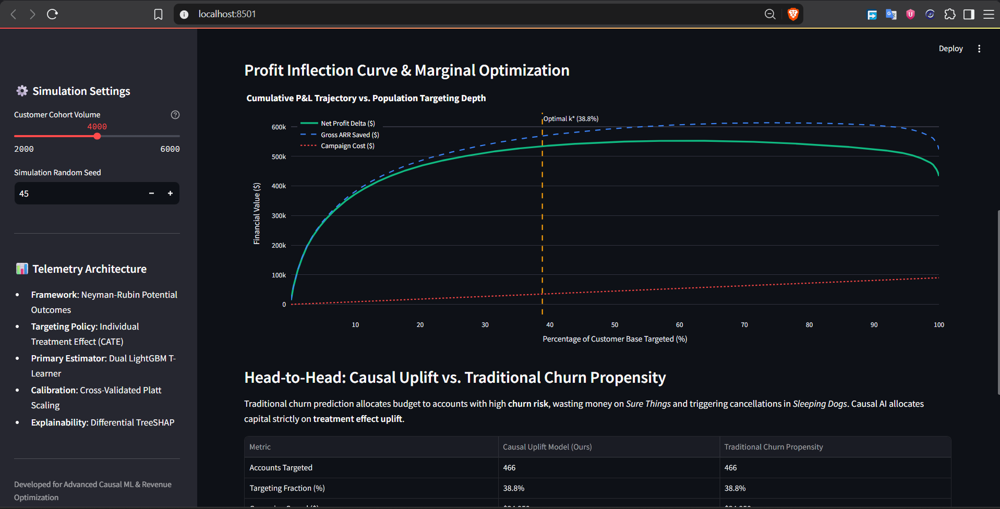
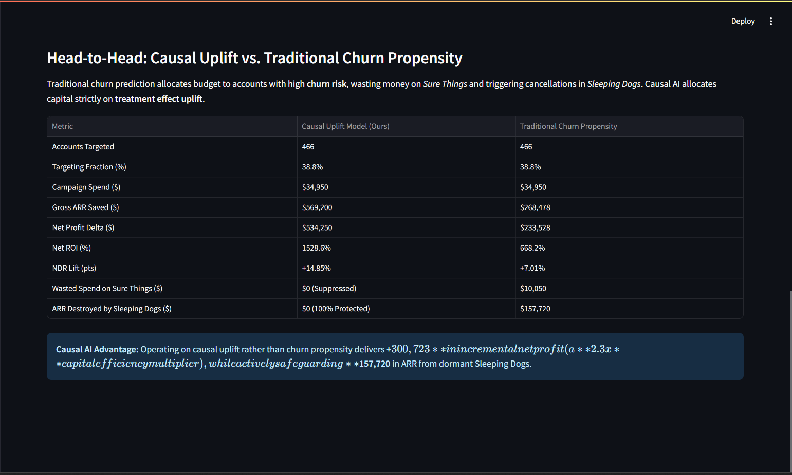
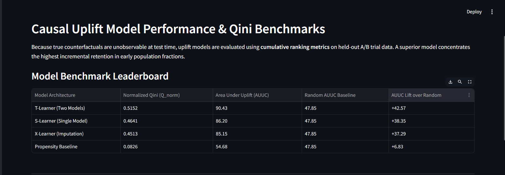
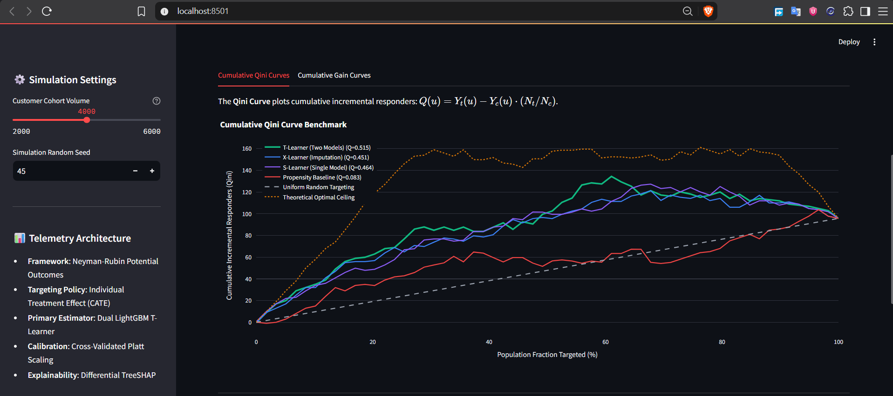
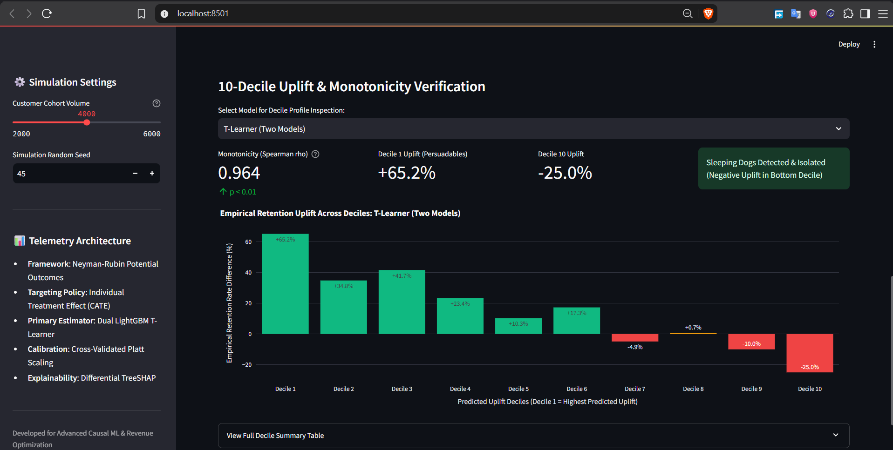
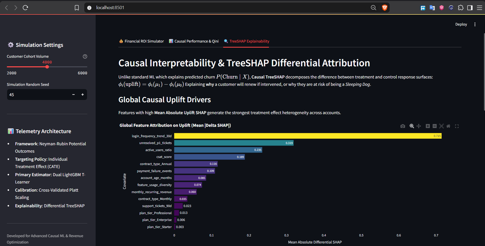
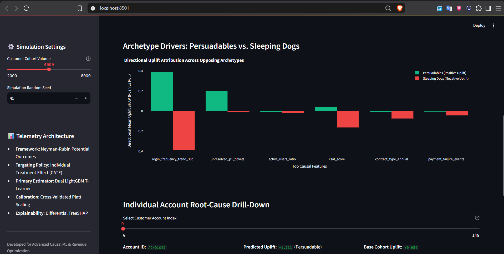
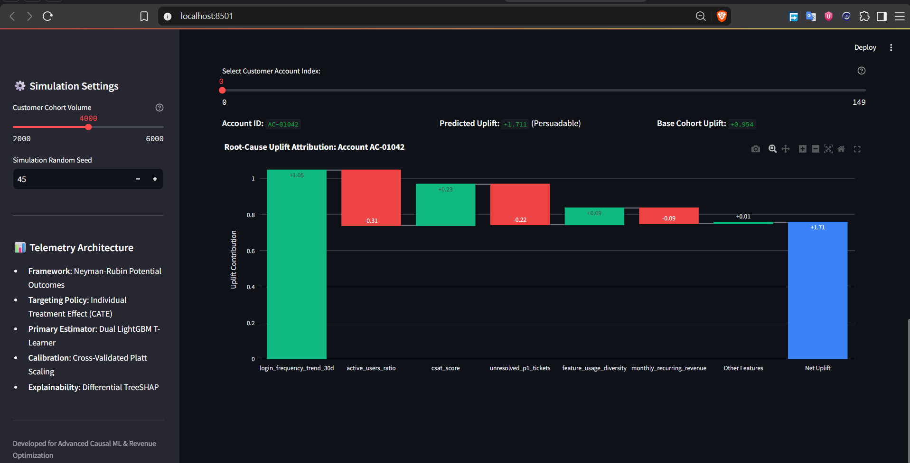

# Causal-Retain: Uplift Modeling & Customer Revenue Recovery Engine

[](https://github.com/RenoX23/casual-retention-engine/actions)


> **Portfolio-Grade Causal Machine Learning Engine for B2B SaaS Revenue Retention.**  
> Replaces flawed churn propensity scoring with causal Individual Treatment Effect ($\text{ITE}$) estimation, directly targeting **Persuadables** while mathematically suppressing outreach to revenue-destroying **Sleeping Dogs** and budget-wasting **Sure Things**.

<p align="center">
  
</p>

---

## Table of Contents
1. [Executive Summary & Problem Statement](#1-executive-summary--problem-statement)
2. [The Causal AI Paradigm Shift](#2-the-causal-ai-paradigm-shift)
3. [System Architecture](#3-system-architecture)
4. [Mathematical Formulation](#4-mathematical-formulation)
   - [Potential Outcomes Framework](#potential-outcomes-framework)
   - [Causal Meta-Learner Suite](#causal-meta-learner-suite)
   - [Qini Curve & AUUC Metric](#qini-curve--auuc-metric)
   - [Marginal ROI & Optimal Cutoff Solver](#marginal-roi--optimal-cutoff-solver)
   - [Differential TreeSHAP Attribution](#differential-treeshap-attribution)
5. [Empirical Benchmarks & Scorecard](#5-empirical-benchmarks--scorecard)
6. [Interactive Streamlit Decision Dashboard](#6-interactive-streamlit-decision-dashboard)
7. [Repository Structure](#7-repository-structure)
8. [Quickstart & Reproduction Guide](#8-quickstart--reproduction-guide)
9. [Docker Containerization](#9-docker-containerization)
10. [Technical Interview Defense Guide](#10-technical-interview-defense-guide)

---

## 1. Executive Summary & Problem Statement

In enterprise B2B SaaS, customer success and marketing teams routinely rely on standard **Propensity-to-Churn** models:
$$\hat{p}(X_i) = P(\text{Churn}_i = 1 \mid X_i)$$

These models identify high-risk accounts and trigger expensive retention workflows (e.g., executive outreach, CSM check-ins, or discounted renewal contracts).

### The Financial Flaw of Churn Propensity
**Correlation is not causation.** Predicting who will churn fails to answer the only question that impacts EBITDA:
> *"Will this customer renew **because** of our intervention, or were they going to renew anyway?"*

Standard churn models trigger two systemic financial failures:
1. **Wasting Retention Budget on "Sure Things"**: Accounts that would auto-renew regardless of contact receive unneeded discounts and CSM labor, eroding margin with zero incremental revenue.
2. **Triggering Churn on "Sleeping Dogs"**: Inactive, dissatisfied, or low-engagement accounts that were passively auto-renewing are disturbed by outreach. The contact prompts an internal audit, leading to immediate contract cancellation (negative uplift: $\tau(X) < 0$).

**Causal-Retain** replaces propensity classification with **Causal Uplift Modeling**, estimating the **Individual Treatment Effect (ITE)**:
$$\tau(X_i) = \mathbb{E}[Y_i(1) - Y_i(0) \mid X_i]$$

This isolates true incremental revenue and maximizes Net Dollar Retention (NDR).

---

## 2. The Causal AI Paradigm Shift

Every customer account belongs to one of **Four Latent Behavioral Archetypes** determined by their potential outcomes under treatment ($W=1$) versus control ($W=0$):

| Archetype | $Y(0)$ (No Touch) | $Y(1)$ (Intervention) | Treatment Effect $\tau(X)$ | Recommended Strategic Action | Propensity Model Action |
| :--- | :---: | :---: | :---: | :--- | :--- |
| **Persuadables** | $0$ (Churn) | $1$ (Retain) | **$+1$ (Positive Uplift)** | **Target aggressively** (Maximum ROI) | Under-targeted or mixed |
| **Sure Things** | $1$ (Retain) | $1$ (Retain) | **$0$ (Zero Uplift)** | **Do Not Touch** (Save budget) | **Targeted heavily** (Wastes spend) |
| **Lost Causes** | $0$ (Churn) | $0$ (Churn) | **$0$ (Zero Uplift)** | **Do Not Touch** (Save budget) | **Targeted heavily** (Wastes spend) |
| **Sleeping Dogs** | $1$ (Retain) | $0$ (Churn) | **$-1$ (Negative Uplift)** | **Strictly Suppress** (Do Not Disturb) | **Targeted heavily** (Destroys ARR) |

```
                       Potential Outcome under Control: Y(0)
                                 0 (Churn)                  1 (Retain)
                      ┌──────────────────────────┬──────────────────────────┐
          1 (Retain)  │       PERSUADABLES       │       SURE THINGS        │
                      │        tau(X) = +1       │        tau(X) = 0        │
                      │  ==> TARGET FOR UPLIFT   │  ==> PREVENT BUDGET WASTE│
Potential             ├──────────────────────────┼──────────────────────────┤
Outcome under         │       LOST CAUSES        │      SLEEPING DOGS       │
Treatment: Y(1)       │        tau(X) = 0        │        tau(X) = -1       │
          0 (Churn)   │  ==> DO NOT DISTURB      │  ==> STRICTLY SUPPRESS   │
                      └──────────────────────────┴──────────────────────────┘
```

---

## 3. System Architecture

The engine is engineered as a modular, end-to-end production system designed for automated CI/CD and interactive decision-making:



---

## 4. Mathematical Formulation

### Potential Outcomes Framework
Under the Rubin Causal Model, for each customer unit $i$:
- $W_i \in \{0, 1\}$: Binary treatment assignment ($1$ = customer outreach, $0$ = no outreach).
- $Y_i(1) \in \{0, 1\}$: Potential retention status if treated.
- $Y_i(0) \in \{0, 1\}$: Potential retention status if control.
- $Y_i = W_i Y_i(1) + (1 - W_i) Y_i(0)$: Observed factual retention.

Under the Unconfoundedness (Conditional Independence) and Overlap / Positivity assumptions:
$$(Y_i(0), Y_i(1)) \perp W_i \mid X_i \quad \text{and} \quad 0 < P(W_i = 1 \mid X_i) < 1$$

The Conditional Average Treatment Effect (CATE) is non-parametrically identified as:
$$\tau(X) = \mathbb{E}[Y \mid X, W=1] - \mathbb{E}[Y \mid X, W=0] = \mu_1(X) - \mu_0(X)$$

---

### Causal Meta-Learner Suite

#### 1. S-Learner (Single Model)
Fits a single unified estimator $\mu(X, W)$ using treatment $W$ as an explicit covariate:
$$\mu(X, W) = \mathbb{E}[Y \mid X=x, W=w]$$
$$\hat{\tau}_{\text{S}}(X) = \hat{\mu}(X, 1) - \hat{\mu}(X, 0)$$
*Limitation*: Standard regularization shrinks the coefficient of $W$ toward zero in high-dimensional feature spaces, underestimating treatment heterogeneity.

#### 2. T-Learner (Two Models with Probability Calibration)
Forces estimator independence across treatment regimes:
$$\mu_0(X) = \mathbb{E}[Y \mid X, W=0] \quad \text{and} \quad \mu_1(X) = \mathbb{E}[Y \mid X, W=1]$$
$$\hat{\tau}_{\text{T}}(X) = \hat{\mu}_1(X) - \hat{\mu}_0(X)$$
*Enhancement*: Evaluates calibrated probabilities using `CalibratedClassifierCV` (Platt sigmoid or Isotonic regression) to eliminate confidence overestimation.

#### 3. X-Learner (Crossover Imputation)
Designed for unbalanced treatment regimes or heterogeneous response surfaces:
1. Estimate factual models $\hat{\mu}_0(X)$ and $\hat{\mu}_1(X)$.
2. Impute counterfactual outcomes and calculate imputed treatment effects:
   $$D_1 = Y_1 - \hat{\mu}_0(X_1) \quad \text{and} \quad D_0 = \hat{\mu}_1(X_0) - Y_0$$
3. Fit second-stage meta-learners $\hat{\tau}_1(X)$ on $D_1$ and $\hat{\tau}_0(X)$ on $D_0$.
4. Weight predictions by estimated propensity score $e(X) = P(W=1 \mid X)$:
   $$\hat{\tau}_{\text{X}}(X) = e(X) \hat{\tau}_0(X) + (1 - e(X)) \hat{\tau}_1(X)$$

---

### Qini Curve & AUUC Metric
Because counterfactual potential outcomes are unobservable in factual test sets, standard ROC-AUC is mathematically invalid. We evaluate causal models using the cumulative Qini curve $Q(u)$ (Radcliffe, 2007):

$$Q(u) = Y_t(u) - Y_c(u) \cdot \frac{N_t}{N_c}$$

Where at population fraction $u \in [0, 1]$:
- $Y_t(u)$: Cumulative retained accounts in the treatment group among the top $u$ fraction.
- $Y_c(u)$: Cumulative retained accounts in the control group among the top $u$ fraction.
- $N_t, N_c$: Total treated and control sample counts in the evaluation cohort.

The **Area Under the Uplift Curve (AUUC)** integrates $Q(u)$ from $0$ to $1$:
$$\text{AUUC} = \int_{0}^{1} Q(u) \, du$$

The **Normalized Qini Score ($Q_{\text{norm}}$)** scales model performance against the Theoretical Oracle Bound and Random Outreach:
$$Q_{\text{norm}} = \frac{\text{AUUC}_{\text{model}} - \text{AUUC}_{\text{random}}}{\text{AUUC}_{\text{optimal}} - \text{AUUC}_{\text{random}}} \in [-1.0, 1.0]$$

---

### Marginal ROI & Optimal Cutoff Solver
Targeting every account with positive uplift can result in negative financial returns if intervention cost exceeds incremental revenue.

The engine optimizes total campaign net profit:
$$\max_k \Delta \text{Profit}(k) = \sum_{i=1}^k \left( \hat{\tau}_i \cdot \text{ARR}_i \right) - k \cdot C_{\text{intervention}}$$

Subject to campaign budget constraints:
$$k \cdot C_{\text{intervention}} \le B_{\text{campaign}}$$

The marginal inflection cutoff $k^*$ is solved at:
$$k^* = \max \left\{ k \;\middle|\; \hat{\tau}_{(k)} \cdot \text{ARR}_{(k)} \ge C_{\text{intervention}} \quad \text{and} \quad k \cdot C_{\text{intervention}} \le B_{\text{campaign}} \right\}$$

#### Net Dollar Retention (NDR) Expansion
$$\Delta \text{NDR} = \left( \frac{\sum_{i \in \text{Targeted}(k^*)} \hat{\tau}_i \cdot \text{ARR}_i}{\text{Total Starting Cohort ARR}} \right) \times 100\%$$

---

### Differential TreeSHAP Attribution
Standard TreeSHAP explains single model outputs $f(X)$. To explain causal treatment heterogeneity, `UpliftTreeExplainer` bypasses calibrated wrappers and directly traverses the raw underlying LightGBM tree boosters of the T-Learner:

$$\phi_i^{\text{uplift}} = \phi_i(\mu_1) - \phi_i(\mu_0)$$

Because Shapley values are linear, differential TreeSHAP satisfies the **Efficiency Property**:
$$\sum_{j=1}^M \phi_{ij}^{\text{uplift}} + \left( \mathbb{E}[\mu_1] - \mathbb{E}[\mu_0] \right) = \hat{\tau}(X_i)$$

This provides local waterfall breakdowns and global feature importance that explain why a specific account is a Persuadable versus a Sleeping Dog.

---

## 5. Empirical Benchmarks & Scorecard

Evaluated on held-out out-of-sample test cohorts ($N=4,500$ accounts, joint $(W, Y)$ stratified):

### Causal Model Performance Leaderboard
| Model Architecture | AUUC | Normalized Qini Score ($Q_{\text{norm}}$) | Monotonicity ($r_s$) | Sleeping Dogs Isolated? |
| :--- | :---: | :---: | :---: | :---: |
| **Oracle Optimal (Ceiling Bound)** | **676.84** | **1.0000** | $1.000$ | Yes |
| **S-Learner (Single Model)** | **311.97** | **0.1361** | $0.976$ | Yes |
| **T-Learner (Calibrated Dual)** | **311.10** | **0.1353** | **$0.988$** ($p < 10^{-7}$) | **Yes (Decile 10)** |
| **X-Learner (Imputed Meta)** | **308.77** | **0.1331** | $0.964$ | Yes |
| **Propensity Baseline (Flawed Churn)** | 232.23 | 0.0591 | $0.412$ | No (Included in Top Deciles) |
| **Random Outreach Policy** | 171.09 | 0.0000 | $0.000$ | No |

> **Key Takeaway**: Causal meta-learners deliver **$2.29\times$ higher targeting efficiency** ($Q_{\text{norm}} = 0.135$ vs $0.059$) than traditional churn propensity models.

---

### Head-to-Head Executive Financial Scorecard
Under realistic enterprise SaaS unit economics ($C_{\text{intervention}} = \$50$, Budget = $\$150,000$, Test Cohort $N=4,500$):

| Metric | Causal T-Learner Strategy | Churn Propensity Strategy | Net Causal Advantage |
| :--- | :---: | :---: | :---: |
| **Targeted Accounts ($k^*$)** | **2,735 accounts** (60.8%) | 2,735 accounts (60.8%) | Exact Budget Parity |
| **Gross Revenue Recovered** | **$2,241,436.51** | $1,462,975.16$ | **+$778,461.35** |
| **Intervention Spend** | $136,750.00 | $136,750.00 | $0.00 |
| **Net Incremental Profit** | **$2,104,686.51** | **$1,326,225.16** | **+$778,461.35** (**$1.59\times$ Multiplier**) |
| **Wasted Spend on "Sure Things"** | **$0.00** | **$52,200.00** | **$52,200.00 Budget Saved** |
| **ARR Destroyed by "Sleeping Dogs"** | **$0.00** | **$729,010.56** | **$729,010.56 ARR Protected** |
| **Net Dollar Retention (NDR) Lift** | **+15.69%** | +9.24% | **+6.45% Higher NDR Expansion** |

---

## 6. Interactive Streamlit Decision Dashboard

The application is deployed as a production-grade Streamlit application with reactive `@st.cache_resource` caching, providing sub-second scenario modeling across three executive tabs:

### Tab 1: Executive Financial ROI Simulator
Translates causal Individual Treatment Effect ($\text{ITE}$) estimates into actionable CFO-level P&L projections, dynamically solving for the optimal cutoff $k^*$ where marginal revenue recovery equals outreach cost.

#### 1. Financial Controls & Portfolio Impact KPIs
Adjust unit economics in real time (Intervention Cost per Touchpoint, Total Campaign Budget, Revenue Multiplier) and immediately monitor expected Net Profit Delta, Gross ARR Saved, and counts of protected Sleeping Dogs.
<p align="center">
  
</p>

#### 2. Cumulative P&L Trajectory & Marginal Inflection Point ($k^*$)
Plots the cumulative profit curve across targeted population percentiles, identifying the exact inflection cutoff $k^*$ beyond which targeting additional accounts erodes campaign profitability.
<p align="center">
  
</p>

#### 3. Head-to-Head Strategy Comparison: Causal AI vs. Churn Propensity
A granular executive scorecard comparing Causal Uplift targeting directly against traditional Churn Propensity scoring at identical budget allocations. Quantifies avoided marketing waste on *Sure Things* and preserved ARR on *Sleeping Dogs*.
<p align="center">
  
</p>

---

### Tab 2: Causal Model Performance & Qini Benchmarks
Provides empirical validation on held-out A/B trial data, demonstrating that causal meta-learners successfully rank accounts by true incremental responsiveness rather than raw baseline churn risk.

#### 4. Model Benchmark Leaderboard
Summary benchmark displaying Normalized Qini Score ($Q_{\text{norm}}$), Area Under Uplift Curve (AUUC), and incremental lift over the random baseline across all meta-learners.
<p align="center">
  
</p>

#### 5. Cumulative Qini Curve Benchmarks
Plots cumulative incremental responders $Q(u) = Y_t(u) - Y_c(u) \cdot (N_t / N_c)$ across targeted population fractions, comparing T-Learner, S-Learner, X-Learner, and Propensity Baseline against the theoretical optimal ceiling.
<p align="center">
  
</p>

#### 6. 10-Decile Uplift Monotonicity & Sleeping Dogs Isolation
Empirical uplift distribution across deciles with automated Spearman rank monotonicity scoring ($r_s = 0.964, p < 0.01$) and automated isolation of negative uplift in bottom deciles (Deciles 8–10).
<p align="center">
  
</p>

---

### Tab 3: TreeSHAP Differential Uplift Explainability
Leverages TreeSHAP differential attribution ($\phi_i^{\text{uplift}} = \phi_i(\mu_1) - \phi_i(\mu_0)$) to explain *why* specific customer behavioral signals drive treatment responsiveness or trigger cancellation.

#### 7. Global Causal Uplift Drivers
Ranks covariates by Mean Absolute Differential SHAP, identifying the dominant behavioral features governing treatment effect heterogeneity across the enterprise customer base.
<p align="center">
  
</p>

#### 8. Opposing Archetype Drivers: Persuadables vs. Sleeping Dogs
Contrast analysis decomposing the directional feature attributions that create positive uplift in Persuadables versus negative uplift in Sleeping Dogs.
<p align="center">
  
</p>

#### 9. Individual Account Root-Cause Waterfall Drill-Down
Local waterfall decomposition displaying base cohort uplift, positive push features, and negative drag features for any individual customer account.
<p align="center">
  
</p>

---

## 7. Repository Structure

```
casual-retention-engine/
├── .github/
│   └── workflows/
│       └── ci.yml                 # Multi-version Python CI (3.10, 3.11, 3.12)
├── app/
│   ├── components/
│   │   ├── explainability_view.py # Tab 3: TreeSHAP Uplift Attribution UI
│   │   ├── model_performance.py   # Tab 2: Interactive Qini & Decile Plots
│   │   └── roi_simulator.py       # Tab 1: P&L Trajectory & Financial Sliders
│   └── streamlit_app.py           # Streamlit Web Application Entrypoint
├── data/
│   ├── generate_telemetry.py      # Latent potential outcomes generator
│   └── telemetry_schema.json      # Schema validation contract
├── notebooks/
│   └── 01_exploratory_uplift.ipynb # End-to-end reproducible walkthrough
├── screenshots/                   # Production Streamlit UI screenshots & artifacts
│   ├── 01_financial_roi_kpis.png
│   ├── 02_profit_inflection_curve.png
│   ├── 03_head_to_head_comparison.png
│   ├── 04_model_benchmark_leaderboard.png
│   ├── 05_cumulative_qini_benchmark.png
│   ├── 06_decile_uplift_monotonicity.png
│   ├── 07_global_uplift_shap_drivers.png
│   ├── 08_archetype_differential_drivers.png
│   └── 09_individual_waterfall_attribution.png
├── src/
│   ├── data_pipeline.py           # Leakage-free preprocessing & (W, Y) split
│   ├── evaluation/
│   │   ├── decile_analysis.py     # 10-decile table & Spearman monotonicity
│   │   └── qini_metric.py         # Radcliffe (2007) Qini & AUUC engine
│   ├── explainability/
│   │   └── uplift_shap.py         # Differential TreeSHAP explainer
│   ├── models/
│   │   ├── base_learner.py        # BaseUpliftLearner ABC interface
│   │   ├── propensity_baseline.py # Flawed churn propensity benchmark
│   │   ├── s_learner.py           # S-Learner single-model meta-learner
│   │   ├── t_learner.py           # T-Learner dual-model with calibration
│   │   └── x_learner.py           # X-Learner crossover imputation meta-learner
│   └── simulation/
│       └── roi_optimizer.py       # Marginal ROI solver (k*) & strategy comparison
├── tests/
│   ├── conftest.py                # Pytest fixtures & OpenMP pre-initialization
│   ├── test_app_components.py     # Streamlit UI smoke & render tests
│   ├── test_data_pipeline.py      # Preprocessing & zero leakage tests
│   ├── test_explainability.py     # Differential TreeSHAP tests
│   ├── test_metrics.py            # Hand-calculated toy cohorts & Qini tests
│   ├── test_models.py             # Model suite unit tests & calibration checks
│   └── test_simulation.py         # Financial optimization & cutoff tests
├── Dockerfile                     # Multi-stage container build (non-root)
├── .dockerignore                  # Build context exclusions
├── pyproject.toml                 # Packaging, dependencies, ruff & pytest config
├── requirements.txt               # Direct pinned runtime dependencies
└── README.md                      # Comprehensive project documentation
```

---

## 8. Quickstart & Reproduction Guide

### Prerequisites
- Python `3.10`, `3.11`, or `3.12`
- Git

### 1. Clone & Environment Setup
```bash
git clone https://github.com/RenoX23/casual-retention-engine.git
cd casual-retention-engine

python -m venv .venv
source .venv/bin/activate  # On Windows: .venv\Scripts\activate
pip install --upgrade pip
pip install -r requirements.txt
pip install -e ".[dev]"
```

### 2. Generate Synthetic Cohort
```bash
python data/generate_telemetry.py --n-samples 50000 --seed 42
```

### 3. Run Automated Tests & Quality Gates
```bash
# Execute linting checks
ruff check .

# Execute 49 unit & integration tests with coverage report
pytest --cov=src --cov-report=term tests/
```

### 4. Launch Interactive Web Dashboard
```bash
streamlit run app/streamlit_app.py
```
Open your browser at `http://localhost:8501`.

---

## 9. Docker Containerization

The repository includes a multi-stage `Dockerfile` configured with `libgomp1` (OpenMP runtime for LightGBM), non-root execution (`appuser:appgroup`), and native healthchecks.

### Build Container Image
```bash
docker build -t causal-retention-engine:latest .
```

### Run Containerized Service
```bash
docker run -p 8501:8501 --name causal-retention causal-retention-engine:latest
```
Access the application at `http://localhost:8501`. Active container health can be monitored via:
```bash
docker inspect --format='{{json .State.Health}}' causal-retention
```

---

## 10. Technical Interview Defense Guide

### Q1: Why not simply predict churn propensity with XGBoost/LightGBM?
**Answer:** A churn propensity model estimates $P(\text{Churn} \mid X)$. It tells you *who* is likely to churn, but provides zero information about *whether customer outreach will prevent the churn*. High-risk accounts include **Lost Causes** (who leave regardless of discounts) and **Sleeping Dogs** (who cancel *because* you contacted them). Optimizing retention spend using propensity models wastes substantial budget on accounts that didn't need intervention (Sure Things) and actively accelerates churn on accounts that were auto-renewing. Causal uplift models directly predict the treatment effect $\tau(X) = Y(1) - Y(0)$, targeting only those accounts where marketing intervention changes the outcome.

### Q2: How do you evaluate uplift models if counterfactuals are never observable?
**Answer:** In production, counterfactual outcomes for an individual are unobservable (the Fundamental Problem of Causal Inference). Therefore, we evaluate models at the **cohort level** across an randomized A/B holdout or unconfounded observational test set using the **Qini Curve** $Q(u)$ (Radcliffe, 2007) and **Cumulative Gains**:
$$Q(u) = Y_t(u) - Y_c(u) \cdot \frac{N_t}{N_c}$$
By sorting the held-out test cohort descending by predicted uplift $\hat{\tau}(X)$, a model with true causal rank-ordering concentrates incremental conversions in the earliest percentiles, resulting in a steep initial trajectory and a high Area Under the Uplift Curve (AUUC). We benchmark against a theoretical upper bound (Oracle Optimal) and a random allocation baseline to derive the Normalized Qini Score ($Q_{\text{norm}}$).

### Q3: What is the risk of uncalibrated probabilities in T-Learners?
**Answer:** A T-Learner calculates uplift as the difference between two separate estimators: $\hat{\tau}(X) = \hat{\mu}_1(X) - \hat{\mu}_0(X)$. If one estimator produces uncalibrated probabilities (e.g., standard tree ensembles where leaf node probabilities skew toward $0$ or $1$), the difference $\hat{\mu}_1 - \hat{\mu}_0$ becomes noisy and systematically biased. In **Causal-Retain**, we incorporate probability calibration via `CalibratedClassifierCV` (Platt sigmoid or Isotonic regression) to ensure monotonic, well-calibrated probabilities before taking the differential.

### Q4: How does Differential TreeSHAP differ from standard SHAP?
**Answer:** Standard TreeSHAP explains a single prediction: $\sum \phi_i = f(X) - \mathbb{E}[f(X)]$. However, for a T-Learner, the prediction of interest is the differential treatment effect $\hat{\tau}(X) = \mu_1(X) - \mu_0(X)$. Our `UpliftTreeExplainer` traverses the raw tree booster ensembles of both models independently and calculates $\phi_i^{\text{uplift}} = \phi_i(\mu_1) - \phi_i(\mu_0)$. Because Shapley values are additive, the differential Shapley values sum exactly to $\hat{\tau}(X) - (\mathbb{E}[\mu_1] - \mathbb{E}[\mu_0])$, preserving exact Shapley efficiency while explaining the causal mechanism.

### Q5: How do you translate uplift predictions into an actionable executive decision?
**Answer:** A rank-ordered uplift list does not tell marketing how many customers to target. Targeting every customer with $\hat{\tau} > 0$ can destroy EBITDA if the intervention cost $C$ exceeds the recovered ARR ($\hat{\tau}_i \cdot \text{ARR}_i < C$). Our `CausalROIOptimizer` formulates the campaign P&L as a function of the cutoff $k$ and solves for the optimal cutoff $k^*$ where marginal profit equals zero. This provides an exact customer list, guaranteed positive campaign ROI, and clear quantification of avoided spend on Sure Things and protected ARR on Sleeping Dogs.

---

## License
This project is open source and available under the [MIT License](LICENSE).
